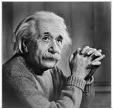
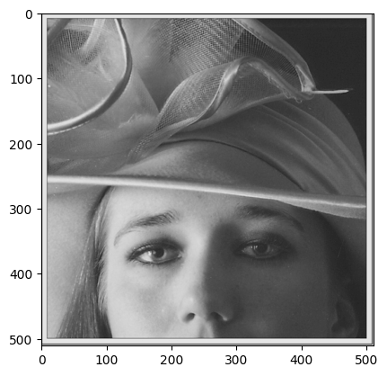
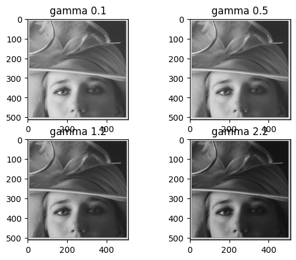
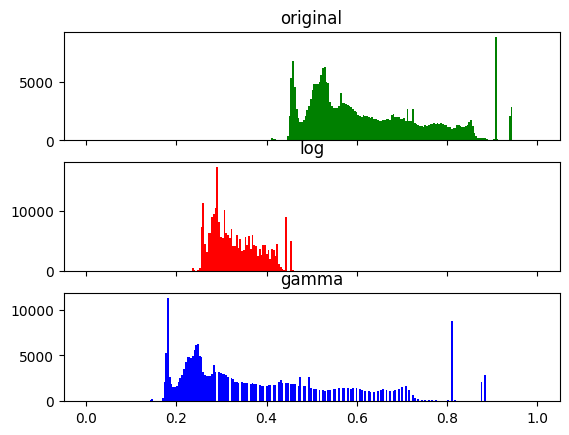
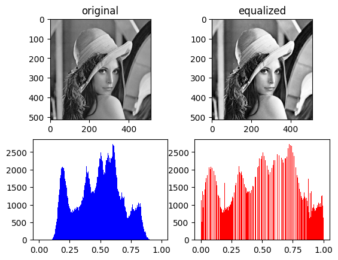
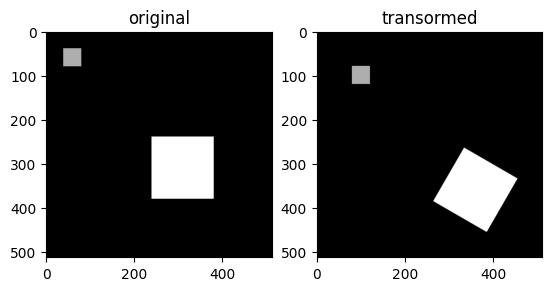
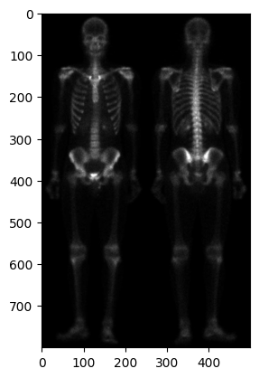
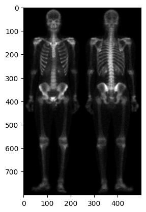
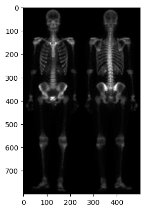

Table of Contents

Contents

[1. Introduction](#1-introduction)

[2. Questions](#2-questions)

[2.1 Zooming Methods](#21-zooming-methods)

[2.1.1 Pixel Replication Method](#211-pixel-replication-method)

[2.1.2 Zero-Order Hold Method](#212-zero-order-hold-method)

[2.1.3 Zoom Factor impact](#213-zoom-factor-impact)

[2.1.4 Improved Zooming Method](#214-improved-zooming-method)

[2.2 Contrast Improvement](#22-contrast-improvement)

[2.2.1 Log Correction and Gamma Correction](#221-log-correction-and-gamma-correction)

[2.2.2 Results](#222-results)

[2.3 Histogram Equalization](#23-histogram-equalization)

[2.3.1 Methodology](#231-methodology)

[2.3.2 Results](#232-results)

[2.4 Image Translation](#24-image-translation)

[2.4.1 Problem](#241-problem)

[2.4.2 Methodology](#242-methodology)

[2.5 Skeleton Image Improvement](#25-skeleton-image-improvement)

[3. Conclusion](#3-conclusion)

# 1. Introduction

Image processing is the process of transforming an image into a digital form and performing certain operations to get some useful information from it. The image processing system usually treats all images as 2D signals when applying certain predetermined signal processing methods.

In this exercise we will practice and discuss about some basic image transformation tasks

# 2. Questions

## 2.1 Zooming Methods

This question asked to perform some zooming tasks on the gray scale image below (Fig 2.1)

Figure 2.1

### 2.1.1 Pixel Replication Method

Pixel replication is also known as nearest neighbor interpolation because using it we can only replicate the neighboring pixels. Let's see how this method work.

In the pixel replication method, new pixels are produced through the existing pixels or already given pixels of the input image. Every pixel of the input picture is replicated n times row-wise and n times column-wise, and the input image gets zoomed.

1.  Advantages
    1.  This method is easy to implement as the pixels are copied into adjacent rows and columns.
2.  Disadvantages
    1.  The image produced by this method is always too blurry because of the increased zooming factor. As the zooming factor increases, the image gets more blurred.

### 2.1.2 Zero-Order Hold Method

The zero-order hold is also known as zoom twice because we can only zoom twice by this method.

We pick two adjacent elements from a row in the zero-order hold method. We then add these elements. After the addition, we divide the result by two. Then the resulting number is placed between the adjacent elements we picked earlier.

1.  Advantages
    1.  This method does not produce a blurry image, unlike the other methods.
    2.  We can always double the image resolution without any special effort.
    3.  It is easy to implement with zero computation overhead.
2.  Disadvantages
    1.  This method can only run on the power of two.
    2.  Because of the power two, it doesn't allow us to zoom images by custom resolution.

### 2.1.3 Zoom Factor impact

By Increasing the zoom factor the images get more blurry However zero-order hold method sustains the images details more than the pixel replication method

### 2.1.4 Improved Zooming Method

Another method of zooming images is the k-times zooming method

K-times zooming is the most widely used and precise method because it covers the limitations of both pixel replication and zero-order hold zooming

K-times zooming is performed through the following steps:

1\. We pick two adjacent pixels and subtract the smaller pixel from the greater one. The result of subtraction is also known as OP.

2\. After this, we divide the output (OP) with k, the alphabet k from the name is the zooming factor, add the result to the smaller pixel picked earlier, and put this value between the adjacent pixels.

3\. Again add the value (OP) to the value we got from the previous step and put the new value next to the previous put value.

4\. We'll repeat this process till we successfully place k−1 values in the existing image.

The advantages of the K-times zooming method are as follows:

1.  This method can zoom the image by any zooming factor than the pixel replication.
2.  The image produced by this method is less blurry than the zero-order hold method.

The disadvantage of the K-times zooming method is as follows:

1.  This algorithm has an overhead of sorting the values at the end, which is an additional step to previous algorithms.

## 2.2 Contrast Improvement

### 2.2.1 Log Correction and Gamma Correction

Log Correction

Mathematically, log transformations can be expressed as s = clog(1+r). Here, s is the output intensity, r\>=0 is the input intensity of the pixel, and c is a scaling constant. c is given by 255/(log (1 + m)), where m is the maximum pixel value in the image. It is done to ensure that the final pixel value does not exceed (L-1), or 255. Practically, log transformation maps a narrow range of low-intensity input values to a wide range of output values. Consider the following input image.

Gamma Correction

Power-law (gamma) transformations can be mathematically expressed ass = cr\^gamma. Gamma correction is important for displaying images on a screen correctly, to prevent bleaching or darkening of images when viewed from different types of monitors with different display settings. This is done because our eyes perceive images in a gamma-shaped curve, whereas cameras capture images in a linear fashion. Below is the Python code to apply gamma correction.

### 2.2.2 Results

Applying the log stretching method on the image results to a brighter image than the original. The resulting image is shown in figure 2.2

Figure 2.2

After applying the gamma correction method with various gamma values the resulting image with gamma value of 2.2 had better contrast than the others. Results are shown in figure 2.3

Figure 2.3

Resulting images histograms are shown below in figure 2.4.

Figure 2.4

## 2.3 Histogram Equalization

Histogram equalization is a method to distribute pixel intensity of the image in order to increase the contrast of the image.

### 2.3.1 Methodology

For this question we first normalized the image and then used the opencv built in equalizeHist function to equalize the image histogram.

### 2.3.2 Results

After applying the equalization the resulting image was brighter and had a better contrast than the original. You can see the resulting image and the original image along with their respective histograms below in figure 2.5.

Figure 2.5

## 2.4 Image Translation

### 2.4.1 Problem

In this question it was asked to move the smaller square by 40 pixels in horizontal and vertical axes and to rotate the large square by 60 degrees.

### 2.4.2 Methodology

The warpAffine function is used for translations in opencv in order to move the small square 40 pixels we had to find corners of the square and then add 40 to each corner index to form the translate matrix after that by using the getAffineTransform function the transform matrix is made and is used to move the square using the warpAffine function.

For the rotation task thing were a little bit different the rotation matrix is made using the getRotationMatrix2D which is made by passing the center of the desired part of the image, howewer doing this will result in the rotation of the whole picture so in order to prevent this, I cropped the large square from the original image and rotated the square in a separate picture after that I added the square back in its location.

The resulting picture can be seen in figure 2.6.

Figure 2.6

## 2.5 Skeleton Image Improvement

In this question it was asked to apply three functions on a given picture and compare the results, the functions and their respective results are as followed:

1.  g(x,y) = e\^cf(x,y) (figure 2.7)
2.  g(x,y) = clog10[f(x,y)+1] (figure 2.8)
3.  g(x,y) = {f(x,y) = f(x,y) if f(x,y) \< 0.1;f(x,y) = 2\*f(x,y) else} (figure 2.9)

    

    Figure 2.7

    

    Figure 2.8

    

    Figure 2.9

    the log10 function produces better results because the details in the resulted image are more preserveable where as in the other two functions the resulting images either lose details or does not have any significant changes

# 3. Conclusion

These were some of the basic and very important tasks of image processing also they may seem simple sometimes they can be tricky and it is good practice to review these concepts once in a while.
